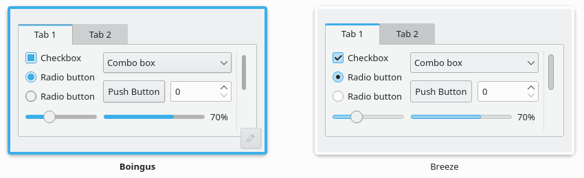
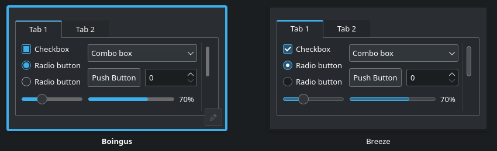

# *B O I N G U S*

This is a fork of an older version of [Breeze](https://invent.kde.org/plasma/breeze), with the goal of keeping the visual style of Breeze before the Blue Ocean redesign in Plasma 5.23.

I chose the name 'Boingus' so that it doesnt overwrite your currently installed Breeze theme.

Only the application style is touched by the theme. The window decoration is also included but it looks a bit ugly so I recommend using something like [Klassy](https://github.com/paulmcauley/klassy) instead for the window decoration.

## SCREENSHOTS


(woah)

## HOW TO INSTALL

### Dependencies

Yoinked from https://github.com/n4n0GH/hello
<details>
<summary> Ubuntu (and Debian) </summary>

```
sudo apt install cmake build-essential libkf5config-dev libkdecorations2-dev libqt5x11extras5-dev qtdeclarative5-dev extra-cmake-modules libkf5guiaddons-dev libkf5configwidgets-dev libkf5windowsystem-dev libkf5coreaddons-dev libkf5iconthemes-dev gettext qt3d5-dev
```

</details>

<details>
<summary> Arch Linux </summary>

```
sudo pacman -S cmake extra-cmake-modules kdecoration qt5-declarative qt5-x11extras
```

</details>
<details>
<summary> Fedora </summary>

```
sudo dnf install cmake extra-cmake-modules "cmake(Qt5Core)" "cmake(Qt5Gui)" "cmake(Qt5DBus)" "cmake(Qt5X11Extras)" "cmake(KF5GuiAddons)" "cmake(KF5WindowSystem)" "cmake(KF5I18n)" "cmake(KDecoration2)" "cmake(KF5CoreAddons)" "cmake(KF5ConfigWidgets)" "cmake(Qt5UiTools)" "cmake(KF5GlobalAccel)" "cmake(KF5IconThemes)" kwin-devel libepoxy-devel "cmake(KF5Init)" "cmake(KF5Crash)" "cmake(KF5KIO)" "cmake(KF5Notifications)" kf5-kpackage-devel
```

</details>

<details>

<summary> openSUSE </summary>

```
sudo zypper install cmake gcc-c++ extra-cmake-modules libQt5Gui-devel libQt5DBus-devel libqt5-qttools-devel libqt5-qtx11extras-devel libQt5OpenGL-devel libQt5Network-devel libepoxy-devel kconfig-devel kconfigwidgets-devel kcrash-devel kglobalaccel-devel ki18n-devel kio-devel kservice-devel kinit-devel knotifications-devel kwindowsystem-devel kguiaddons-devel kiconthemes-devel kpackage-devel kwin5-devel xcb-util-devel xcb-util-cursor-devel xcb-util-wm-devel xcb-util-keysyms-devel
```

</details>

<details>
<summary> Solus </summary>

```
sudo eopkg install extra-cmake-modules kdecoration-devel qt5-declarative-devel qt5-x11extras-devel qt5-base-devel kcoreaddons-devel kguiaddons-devel kconfigwidgets-devel kwindowsystem-devel ki18n-devel kiconthemes-devel kcmutils-devel libxcb-devel xcb-util-devel qt5-wayland-devel kwayland-devel wayland-devel frameworkintegration-devel
```

</details>

### Build and install

```
git clone --single-branch --depth=1 https://github.com/dingusreal/boingus.git

cd boingus && mkdir build && cd build

cmake -DCMAKE_INSTALL_PREFIX=/usr -DCMAKE_INSTALL_LIBDIR=lib -DBUILD_TESTING=OFF ..

make
```
`sudo make install` for some reason currently causes the theme to break (womp womp), so you will have to manually use: 
```
sudo cp bin/boingus.so /usr/lib64/qt5/plugins/styles/boingus.so
```


### Uninstall

If you did `sudo make install`, then inside the build folder, do:
```
sudo make uninstall
```
If you manually copied boingus.so, then instead do:
```
sudo rm /usr/lib64/qt5/plugins/styles/boingus.so
```
(note: `sudo rm` should never be used for things unless you know what you are doing!)

